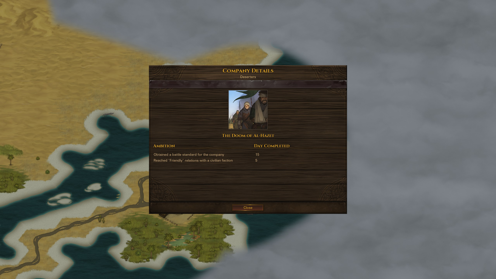

# Company Details Screen

A mod for the game Battle Brothers ([Steam](https://store.steampowered.com/app/365360/Battle_Brothers/), [GOG](https://www.gog.com/game/battle_brothers), [Developer Site](http://battlebrothersgame.com/buy-battle-brothers/)).

## Table of contents

-   [Features](#features)
-   [Requirements](#requirements)
-   [Installation](#installation)
-   [Uninstallation](#uninstallation)
-   [Compatibility](#compatibility)
-   [Building](#building)
-   [Acknowledgements](#acknowledgements)

## Features

Adds a new "Company Details" screen to the game that displays details about the player's company, such as origin and ambitions completed. The screen can be accessed in the world map via a button in the topbar, or by pressing the "K" key.

## Requirements

1) [Modding Script Hooks](https://www.nexusmods.com/battlebrothers/mods/42) (v20 or later)

## Installation

1) Download the mod from the [releases page](https://github.com/jcsato/company_details_screen/releases/latest)
2) Without extracting, put the `company_details_screen_*.zip` file in your game's data directory
    1) For Steam installations, this is typically: `C:\Program Files (x86)\Steam\steamapps\common\Battle Brothers\data`
    2) For GOG installations, this is typically: `C:\Program Files (x86)\GOG Galaxy\Games\Battle Brothers\data`

## Uninstallation

1) Remove the relevant `company_details_screen_*.zip` file from your game's data directory

## Compatibility

This should be fully save game compatible, i.e. you _should_ be safe to remove the mod at any time.

New and modded origins should be supported out of the box. The origin image will be parsed out of its "Description" field, so origins that specify their image differently from vanilla may not display correctly on the new screen.

Mod authors can manually set an origin name and image by loading their mod after this one and pushing a new object with the format `{ ID = <origin_id>, Name = "Origin name", Image = "ui/origin_image.png" }` into the `::CDS.origins` table.

New and modded ambitions should also be supported out of the box, albeit not quite as cleanly. In vanilla, ambitions don't actually proper names, just ids. Rather than display the id (e.g. `ambition.have_z_crowns`) directly, I decided to instead map ambitions to plain English descriptors of what the ambition accomplished (e.g. "Hoarded 50,000 Crowns"). If no such mapping exists for a given ambition, however, the mod will fall back to using the ambition id for a title, replacing underscores with whitespace and capitalizing the words (e.g. "Have Z Crowns"). This is done for all Oathtaker oaths as well, with " fulfilled" appended to read better (e.g. "Oath of Endurance Fulfilled").

Again, mod authors can manually set an ambition title if they don't wish to fall back on the id naming behavior. This can be done by loading their mod after this one and pushing a new object with the format `{ ID = <ambition_id>, Title = "Descriptor of ambition" }` into the `::CDS.ambitions` table.

## Building

To build, first copy the contents of `ini.cfg.example` to a new `ini.cfg` file and set `modkitpath` and `datapath` appropriately. Then, simply run the included `build.bat` script. This will compile and zip the mod and put it in the `dist/` directory - it will also print out any compilation errors, if any are present. The zip behavior requires Powershell / .NET to work, but there's no reason you couldn't sub in 7-zip or another compression utility if you know how and want to.

After building, you can install the mod by running the included `install.bat` script. This will take any existing versions of the mod already in your data directory, append a timestamp to the filename, and move them to an `old_versions/` directory in the mod folder; then it will take the built `.zip` in `dist/` and move it to the data directory.

## Acknowledgements

Thanks to the BB Modding Discord, and especially TaroEld, for helping with getting the UI and ambition-id-to-name functionality added.
